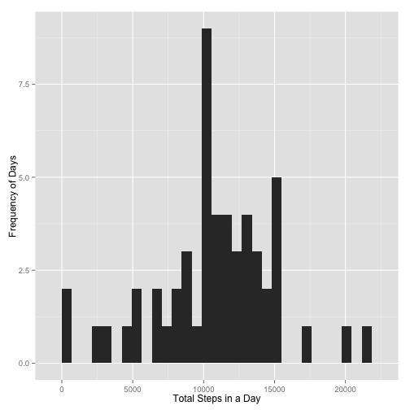
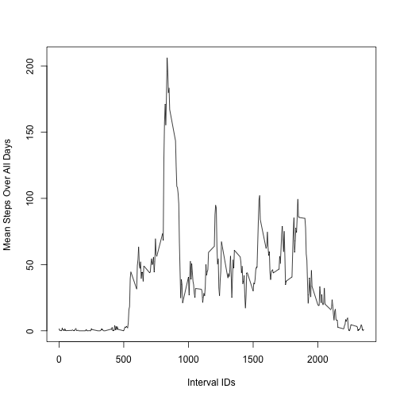
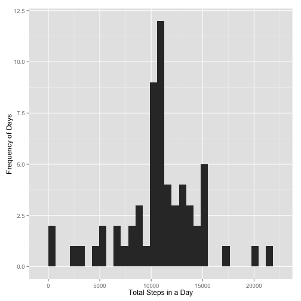
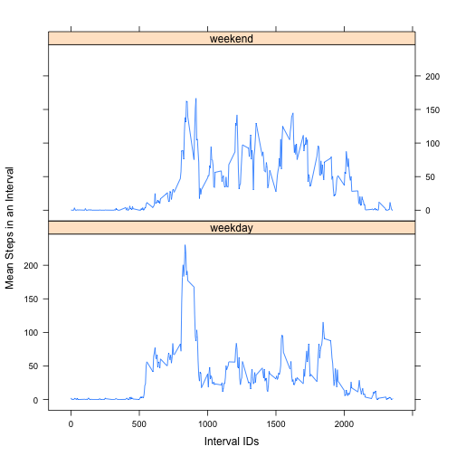

## Introduction
As stated in the official assignment introduction:  

*It is now possible to collect a large amount of data about personal movement using activity monitoring devices such as a Fitbit, Nike Fuelband, or Jawbone Up. These type of devices are part of the “quantified self” movement – a group of enthusiasts who take measurements about themselves regularly to improve their health, to find patterns in their behavior, or because they are tech geeks. But these data remain under-utilized both because the raw data are hard to obtain and there is a lack of statistical methods and software for processing and interpreting the data.*  

*This assignment makes use of data from a personal activity monitoring device. This device collects data at 5 minute intervals through out the day. The data consists of two months of data from an anonymous individual collected during the months of October and November, 2012 and include the number of steps taken in 5 minute intervals each day.*  


##Data

The data for this assignment can be downloaded from the course web site:  

Dataset: [Activity monitoring data](https://d396qusza40orc.cloudfront.net/repdata%2Fdata%2Factivity.zip) [52K]  

The variables included in this dataset are:

**steps:** Number of steps taken in a 5-minute interval (missing values are coded as NA)  
**date:** The date on which the measurement was taken in YYYY-MM-DD format  
**interval:** Identifier for the 5-minute interval in which measurement was taken  

The dataset is stored in a comma-separated-value (CSV) file and there are a total of 17,568 observations in this dataset.


## Loading and preprocessing the data
To start, the **activity.csv** data file (extracted from the ZIP file referenced in the Data
section) must be located in the same directory as the Markdown script used to produce this report.
The **tbl_df** function of the **dplyr** package is used as the first step to facilitate 
manipulation of the data throughout the analysis. Other packages used later on in the script are 
**ggplot2**, **lattice** and **lubridate**, all of which are set as required packages.


```r
require(dplyr)
require(ggplot2)
require(lattice)
require(lubridate)

rawData <- tbl_df(read.csv('activity.csv'))
glimpse(rawData)
```

```
## Observations: 17568
## Variables:
## $ steps    (int) NA, NA, NA, NA, NA, NA, NA, NA, NA, NA, NA, NA, NA, N...
## $ date     (fctr) 2012-10-01, 2012-10-01, 2012-10-01, 2012-10-01, 2012...
## $ interval (int) 0, 5, 10, 15, 20, 25, 30, 35, 40, 45, 50, 55, 100, 10...
```

## What is the mean total number of steps taken per day?
First, it will be necessary to find the total number of steps that were recorded on each day. Rows 
with missing step values are ignored for now.  


```r
totalStepsPerDay <-
    rawData %>%
    group_by(date) %>%
    filter(!is.na(steps)) %>%
    summarize(total = sum(steps))
```

A histogram provides a visual representation of the frequencies for all of the daily step totals:


```r
qplot(total, data = totalStepsPerDay, geom = "histogram",
      xlab = "Total Steps in a Day", ylab = "Frequency of Days")
```

 

The mean and median number of steps per day are calculated as follows:  


```r
mean(totalStepsPerDay$total)
```

```
## [1] 10766.19
```

```r
median(totalStepsPerDay$total)
```

```
## [1] 10765
```


## What is the average daily activity pattern?
A time series plot of the mean number of steps for each 5-minute interval over all the days is 
helpful in providing a visual response to this question:


```r
intervalMeans <-
    rawData %>%
    group_by(interval) %>%
    filter(!is.na(steps)) %>%
    summarize(meanSteps = mean(steps))

plot(
    intervalMeans$interval,
    intervalMeans$meanSteps,
    type="l", xlab="Interval IDs", ylab = "Mean Steps Over All Days"
)
```

 
  
Which 5-minute interval, on average across all days in the dataset, contains the maximum number of steps?  


```r
maxMean <- as.numeric(summarize(intervalMeans, max(meanSteps)))
intervalMeans[intervalMeans$meanSteps==maxMean,]
```

```
## Source: local data frame [1 x 2]
## 
##   interval meanSteps
## 1      835  206.1698
```


## Imputing missing values
There are a number of missing (NA) values within the dataset, and this can be a source of potential 
bias in the final calculations and data summaries. To adjust for this, one strategy would be to 
replace each missing value with the mean number of steps for that corresponding interval.

How many missing values are there?


```r
sum(is.na(rawData$steps))
```

```
## [1] 2304
```

Since the mean number of steps for each interval has already been stored in the **intervalMeans** 
data frame, a new dataset can be created by replacing each missing step value with a calculated 
mean (rounded to the nearest integer) for that interval.


```r
imputedData <- rawData

for(i in 1:nrow(imputedData))
{
    if(is.na(imputedData[i,1]))
    {
        interval <- as.numeric(imputedData[i,3])
        intMean <- as.numeric(intervalMeans[intervalMeans$interval==interval,2])
        imputedData[i,1] <- round(intMean,0)
    }
}
```

Here is the same type of summary information as was produced in the first part of this report, this
time using the imputed values:


```r
totalStepsPerDay <- imputedData %>%
    group_by(date) %>%
    summarize(total = sum(steps, na.rm=TRUE))
```


```r
qplot(total, data = totalStepsPerDay, geom = "histogram",
      xlab = "Total Steps in a Day", ylab = "Frequency of Days")
```

 

The mean and median after imputing missing values:


```r
mean(totalStepsPerDay$total)
```

```
## [1] 10765.64
```

```r
median(totalStepsPerDay$total)
```

```
## [1] 10762
```

Observe that the histogram, mean and median for the dataset with imputed values are each still 
relatively close to those in the raw dataset where the missing values are ignored.

## Are there differences in activity patterns between weekdays and weekends?

To explore this, another field is needed in the raw dataset to indicate whether a date is a weekday 
or a weekend day. This is where the **lubridate** function, **wday**, and 
**dplyr** can be very useful. SIDE NOTE TO PEER REVIEWERS: *I decided to switch to **lattice** for 
this plot since I kept getting an error when trying to use **ggplot** ... all insights on this that 
you'd like to provide by way of comments are greatly appreciated!*


```r
dayTypeList = c('weekend','weekday','weekday','weekday','weekday','weekday','weekend')
imputedData <- mutate(imputedData, dayType = as.factor(dayTypeList[wday(date)]))

intervalMeans <-
    imputedData %>%
    group_by(dayType,interval) %>%
    summarize(meanSteps = mean(steps))

xyplot(
    meanSteps ~ interval | dayType,
    data=intervalMeans,
    layout=c(1,2), type="l",
    xlab="Interval IDs", ylab="Mean Steps in an Interval"
)
```

 

Based on this last plot, there appears to be some evidence of more activity in the midday 5-mintute 
intervals for the weekend days as compared to the same intervals for the weekdays. Since there are 
fewer weekend days than weekdays in the dataset, it would be tricky to provide a definitive answer 
to this section question. Further data collection and analysis would be needed.


